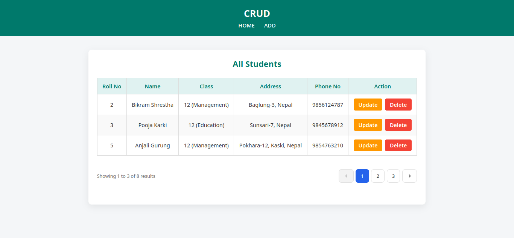
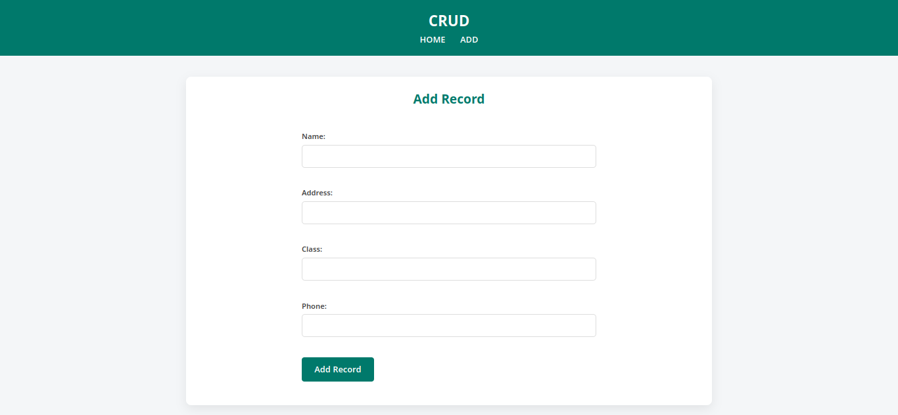
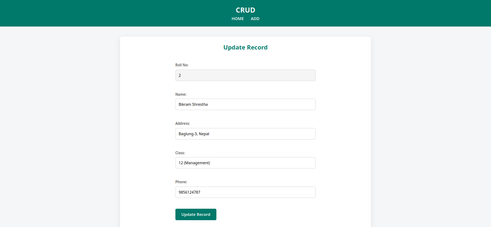
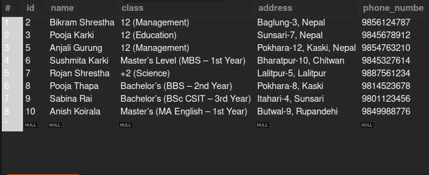

# Laravel CRUD Application

A simple **CRUD System** built with **Laravel**.  
Users can **add**, **view**, **update**, and **delete** student records with pagination and validation.

---

## 📸 Screenshots

### Application Pages

- **Home / All Students**  
  

- **Add Record**  
  

- **Update Record**  
  

---

### Database Structure

- **Students Table**  
  

---

## 🛠 Technologies Used

- PHP (Laravel Framework)  
- MySQL Database  
- Blade Templating Engine  
- HTML5 & CSS3  
- Git & GitHub  

---

## ✨ Features

- Create, Read, Update, Delete (CRUD) student records  
- Pagination for listing students  
- Form validation (required fields, unique phone number)  
- Success & error messages for user feedback  

---

## 💡 What I Learned

- Setting up **models, controllers, and routes** for CRUD operations  
- Handling **form validation** in Laravel  
- Using **Blade templates** for layouts and reusable views  
- Implementing **pagination** for large datasets  
- Working with **Eloquent ORM** for database interaction  

---

## 🧩 Useful Resources

- [Laravel Documentation](https://laravel.com/docs)  
- [Eloquent ORM](https://laravel.com/docs/eloquent)  
- [Blade Templates](https://laravel.com/docs/blade)  

---

**Made by Chitra Shrestha**