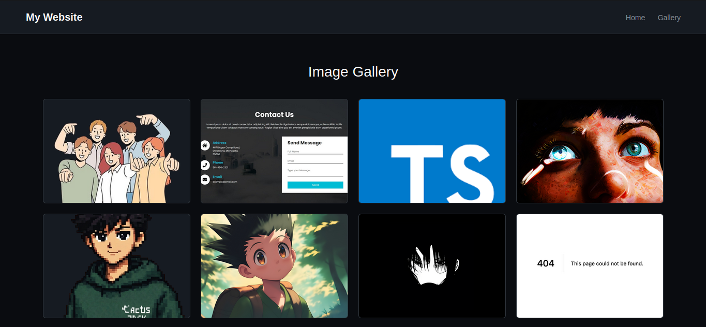
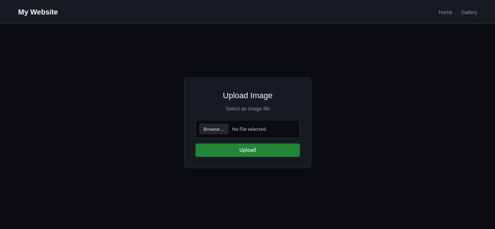
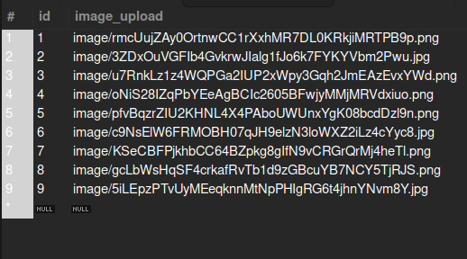

# Laravel Image Gallery

A simple **Image Upload & Gallery System** built with **Laravel**.  
Users can upload images through a clean form and view them in a responsive gallery.

---

## 📸 Screenshots

### 🖼️ Application Pages

- **Gallery Page**  
  

- **Upload Page**  
  

### 🗄️ Database Structure

- **Database Table (Images Table)**  
  

---

## 🛠️ Technologies Used

- **PHP (Laravel Framework)**
- **MySQL Database**
- **Blade Templating Engine**
- **HTML5 & CSS3**
- **Responsive Design** (Mobile, Tablet, Desktop)
- **Git & GitHub**

---

## ✨ Features

- **Image Upload** – Users can upload images via a clean form.
- **Gallery Display** – View all uploaded images in a responsive gallery.
- **Validation** – Only images under 5MB allowed.
- **Storage Management** – Images stored in `storage/app/public` with automatic linking.
- **Responsive Design** – Works seamlessly across devices.
- **User Feedback** – Success and error messages after actions.

---

## 💡 What I Learned

- Setting up Laravel **migrations, models, and controllers** for CRUD operations.
- Handling **file uploads securely**.
- Using **Blade templates** for modular frontend design.
- Implementing **mobile-first responsive layouts**.
- Linking **Laravel storage** to the **public folder** for images.

---

## 🧩 Useful Resources

- [Laravel Documentation](https://laravel.com/docs)

---
